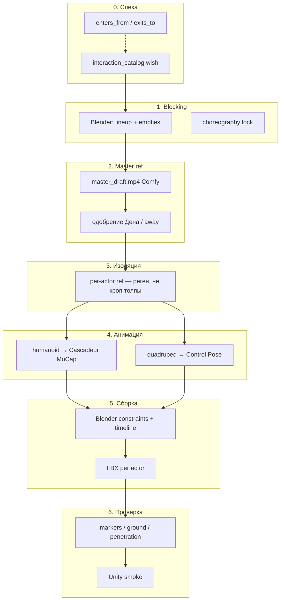

# Пайплайн совместных анимаций (multi-actor)

**Автор идеи:** Den (2026-07-17).  
**Статус:** спецификация + MVP-скелет в коде. Реализация шагов — поэтапно.

Читай вместе с: `COMFY_CASCADEUR_PIPELINE.md`, `CREATURE_PIPELINE.md`, `INTERACTION_SETUP.md` (куда класть файлы), `SHANYA_ANIMATIONS.md`, `VIU_DIRECTION.md`.

---

## Принцип

**Единое видео → разбор на составляющие → анимация каждого актёра → сборка обратно.**

Master ref задаёт **тайминг и хореографию**. MoCap / Control Pose работают **только на изолированном потоке** одного актёра. Сборка — в **Blender**; **Unity** — финальная проверка.

---

## Три слоя данных

| Слой | Что хранит | Где |
|------|------------|-----|
| **Хореография** | состав, роли, маркеры, камера | `interaction_catalog.json` |
| **Движение актёра** | ref, mocap/CP, FBX | `Lab/Interactions/<slug>/actors/<role>/` |
| **Сборка** | blend сцена, constraints, экспорт | `Lab/Interactions/<slug>/assembly/` |

Каталог: `.viu/interaction_catalog.json` (см. `docs/schemas/interaction_catalog.example.json`).

---

## Семь фаз



### Фаза 0 — спека (до GPU)

Вью фиксирует в каталоге:

- `actors[]` — slug из `creature_catalog` или `shanya`, роль (`initiator`, `target`, `bystander`…)
- `choreography` — fps, duration_frames, камера studio (как solo MoCap)
- `sync_markers[]` — события контакта по кадрам (`approach`, `contact_shoulder`, `release`)
- `enters_from` / `exits_to` — **групповой** граф (не solo `idle`)

Инструменты: `interaction_catalog_show`, reflect inject.

### Фаза 1 — blocking (Blender)

Расширение **creature lineup**: статическая сцена, те же масштабы из каталога, empty-точки контакта, общая камера.

Выход: `Lab/Interactions/<slug>/blocking/blocking.blend`

Проверка: дотягивается ли зверь до плеча при их ростах — **до** Comfy.

### Фаза 2 — master ref (Comfy)

Черновик **низкого разрешения**, один дубль:

- 1–3 актёра, читаемые силуэты, **разные цвета** / chroma
- фикс. камера, studio bg, 2–4 с
- общий `choreography lock` (JSON в каталоге)

Выход: `master_draft.mp4` → после одобрения `master_approved.mp4`

**Не MoCapить master напрямую** — только тайминг и одобрение хореографии.

### Фаза 3 — изоляция актёров

**Предпочтительно:** отдельный Comfy I2V/T2V на актёра:

- seed = `photo_front` из `creature_catalog`
- тот же choreography lock
- промпт с ролью; остальные — «blurred silhouettes»

**Fallback:** сегментация master (цвет / SAM2) → ref на чистом фоне.

Выход: `actors/<role>/isolated_ref.mp4`

### Фаза 4 — анимация по типу рига

| `rig_kind` | `motion_path` | Инструмент |
|------------|---------------|------------|
| `humanoid` | `mocap` | Cascadeur Reference + MoCap |
| `quadruped` | `control_pose` | ключи по кадрам маркеров |
| контакт (хват, укус) | `hybrid_keys` | ключи в окне маркера + MoCap на остальное |

Выход: `actors/<role>/mocap.fbx`

### Фаза 5 — сборка (Blender)

Все риги в одной сцене, constraints на маркеры, общий `frame_start`.

**Не dual-mocap:** каждый актёр — свой FBX; стыковка через `active_socket` (girl sockets) + `SyncMarker`.

Код:
- `assembly.py` → `assembly/assembly_job.json` + `viu_interaction_assembly.py`
- Blender headless: импорт клипов, общая timeline, timeline markers, Empty `active_socket` на target
- Lab step «Blender assembly» требует `actors/<role>/mocap.fbx`

Constraints source→socket и экспорт per-role FBX — следующий слой.

Выход: `assembly/assembly.blend` (+ позже `exports/<slug>_<role>.fbx`)

Cascadeur — **доводка одного актёра**, не сборка толпы.

### Фаза 6 — верификация

| Проверка | Критерий |
|----------|----------|
| Marker drift | расстояние между актёрами в кадрах `sync_markers` |
| Ground contact | стопы/лапы на Y=0 |
| Penetration | mesh overlap / socket distance |
| Длина | все FBX = `duration_frames` |
| Граф | группа стыкуется с `enters_from`/`exits_to` |

Провал → `rejected/` + причина в `verify_report`.

Unity: smoke test Animator + сокеты (не авторинг).

---

## Пути на диске

| Что | Куда |
|-----|------|
| Каталог | `.viu/interaction_catalog.json` |
| Рабочая папка сцены | `U:\Anabarra\Library\Lab\Interactions\<slug>\` |
| Master draft/approved | `.../master_draft.mp4`, `master_approved.mp4` |
| Per-actor | `.../actors/<role>/` |
| Blocking / assembly | `.../blocking/`, `.../assembly/` |
| Lab session | `.viu/lab/interaction/session.json` |
| Готовые FBX (финал) | `U:\Anabarra\Animations\interactions\` (позже) |

---

## Lab: topic `interaction`

Расширение `lab_start` / `lab_step` / `lab_run_all`:

```text
lab_start topic=interaction catalog_slug=shanya_wolf_approach
lab_step topic=interaction
lab_run_all topic=interaction
```

Шаги (MVP-скелет в `viu/lab/interaction_pipeline.py`):

| # | Шаг | Статус |
|---|-----|--------|
| 0 | Спека из каталога | ✅ scaffold |
| 1 | Blocking Blender | ✅ `interaction_blocking` / lab step 2 |
| 2 | Master draft Comfy | ✅ `interaction_master_draft` |
| 3 | Одобрение (Telegram/GUI) | ⏳ |
| 4 | Per-actor isolated ref | ⏳ |
| 5 | MoCap / Control Pose | ⏳ |
| 6 | Blender assembly | ✅ сцена: клипы + markers + socket Empty |
| 7 | Verify + отчёт | ⏳ |

VRAM: как у solo — Comfy и Cascadeur **не параллельно** (`VIU_LAB_VRAM_GB`).

---

## Инструменты (tools)

| Tool | Назначение |
|------|------------|
| `interaction_catalog_show` | список / slug / holes / graph |
| `lab_start topic=interaction` | начать сессию по slug |
| `lab_step topic=interaction` | следующий шаг |
| `interaction_blocking` | Blender blocking (актёры + маркеры + камера) |
| `interaction_master_draft` | Comfy Wan → master_draft.mp4 |
| `creature_lineup` | росты в creature_catalog (prerequisite) |
| `comfy_run` / `comfy_triple` | master и per-actor (позже с lock) |
| `cascadeur_status` | MoCap humanoid (когда bridge готов) |
| `blender_command` | blocking / assembly scripts |

---

## Граф переходов (группы)

Параллельно solo-графу Шани (`animation_catalog.json`):

```text
idle_near_pair ──approach──► shanya_wolf_approach ──retreat──► idle_separate
```

Правила:

- Вход в групповую анимацию только из узла `enters_from` (например оба в `idle_near_pair`).
- Выход — в `exits_to`; solo-состояния актёров синхронизируются кодом.
- Нет ребра — Вью **не снимает** клип, пока не закрыты prerequisite solo-узлы.

---

## MoCap vs Control Pose

| Ситуация | Путь |
|----------|------|
| 2 humanoid, studio | MoCap на isolated ref |
| humanoid + quadruped | MoCap + Control Pose |
| grapple / mount | `hybrid_keys` на окне маркера |
| 3+ актёра, сильные окклюзии | blocking + CP по маркерам |

Control Pose **не дублирует** пайплайн — меняется только фаза 4.

---

## MVP-пилот (wave 1)

**Одна сцена:** `shanya_wolf_approach` — Шаня + один волк, подход → касание плеча → отход, ~3 с (72 кадра @24fps).

Не «стая в бою» — это wave 3.

Чеклист готовности пилота:

1. ✅ `interaction_catalog.json` + seed wish
2. ✅ blocking.blend из lineup-ростов (`interaction_blocking`)
3. ⏳ master_draft + approve
4. ⏳ 2× isolated ref
5. ⏳ MoCap Шани + CP волка (ручной допустим)
6. ⏳ assembly.blend → 2 FBX
7. ⏳ verify markers

---

## Связь с существующим кодом

| Модуль | Роль |
|--------|------|
| `creature_catalog` | рост, `photo_front`, appearance для промптов |
| `animation_catalog` | solo prerequisite (`idle`, `walk`…) |
| `interaction_catalog/assembly.py` | socket sync job (клипы + active_socket) |
| `comfy_pipeline` | шаблон lab steps, Telegram approve |
| `cascadeur_pipeline` | FBX import, vision verify |
| `creature_catalog/lineup.py` | база для blocking-сцены |

---

## Анти-паттерны

- MoCap на master с толпой
- Кроп участника из общего видео без маски
- Сборка в Cascadeur (нет multi-rig)
- Генерация hi-res до одобрения draft
- Игнор `sync_markers` — рассинхрон на контакте
- Хвосты/щупальца через MoCap (secondary physics в Unity)
